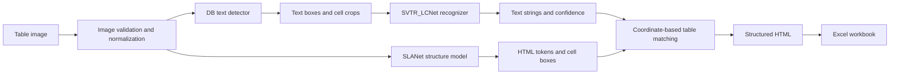

# AutoOCR Table to Excel

End-to-end table recognition for English document images. The system detects
text regions, recognizes cell content, reconstructs table structure, merges
text with cells, and exports both HTML and Excel.

[End-to-end setup and commands](README_END_TO_END.md) ·
[Docker deployment guide (Vietnamese)](README_DOCKER.md) ·
[Download pretrained deployment models](https://drive.google.com/drive/folders/1JH42pMtsKQ1tRaoEezmb3kAaKzxIAAwf?usp=drive_link) ·
[PaddleOCR](https://github.com/PaddlePaddle/PaddleOCR) ·
[PubTabNet](https://github.com/ibm-aur-nlp/PubTabNet)

## Highlights

- Three independently trained stages: DB, SVTR_LCNet, and SLANet.
- PubTabNet 2.0.0 preprocessing for detection, recognition, and structure data.
- Safe mid-epoch checkpoints and resumable training.
- Live `tqdm` metrics for training and validation.
- Structure-aware SLANet checkpoint selection using token similarity, edit
  similarity, TEDS-Structure, and valid HTML rate.
- ONNX Runtime inference with FP32/FP16 model validation.
- FastAPI, Gradio, Docker CPU, Docker GPU, and hybrid CPU/GPU profiles.
- Excel generation with `rowspan` and `colspan` preservation.

## System architecture



The detector/recognizer branch and the structure branch process the same image.
`TableMatch` assigns recognized text to predicted cells, then the resulting HTML
is converted to an `.xlsx` workbook.

## Dataset

The training pipeline uses English **PubTabNet 2.0.0**, which provides table
images, tokenized HTML structures, cell text, and bounding boxes for non-empty
cells. The public corpus contains more than 500,000 tables; this repository's
reproducible training recipe uses:

| Stage | Training subset | Validation subset |
|---|---:|---:|
| DB detector | 30,000 table images | 1,000 table images |
| SVTR_LCNet recognizer | 400,000 cell crops | all crops from the sampled validation tables |
| SLANet | the same 30,000 table images | the same 1,000 table images |

The subset seed is `1024`. Image files are not copied: subset files reference
the original images and generated cell crops.

### Preprocessing

For each PubTabNet record:

1. Validate the image name, dimensions, structure length, and cell metadata.
2. Convert each non-empty cell bounding box to a DB quadrilateral annotation.
3. Crop the cell with configurable padding for recognition training.
4. Preserve inline markup such as `<b>`, `<i>`, `<sup>`, and `<sub>` in the
   recognition label.
5. Keep the original JSONL record unchanged for SLANet.
6. Write derived label files atomically so an interrupted run cannot replace a
   valid label set with a partial one.

## Model 1: DB text detector

The detector is a segmentation-based Differentiable Binarization model:

```text
MobileNetV3-large ×0.5 -> RSEFPN(96) -> DBHead
```

For every pixel, the head predicts a text probability map $$P$$, an adaptive
threshold map $$T$$, and an approximate binary map. Differentiable binarization
uses:

$$\widehat{B}_{ij}=\frac{1}{1+\exp\left[-k\left(P_{ij}-T_{ij}\right)\right]}.$$

The configured DB objective is:

$$\mathcal{L}_{DB} =\alpha\mathcal{L}_{shrink} +\beta\mathcal{L}_{threshold} +\mathcal{L}_{binary}, \qquad \alpha=5,;\beta=10.$$

`DBLoss` uses balanced Dice loss with online hard-example mining for the shrink
map, masked L1 loss for the threshold map, and Dice loss for the binary map.
The OHEM negative-to-positive ratio is `3`.

Detector validation reports precision, recall, and harmonic mean:

$$P=\frac{TP}{TP+FP},\qquad R=\frac{TP}{TP+FN},\qquad H=\frac{2PR}{P+R}.$$

The best detector checkpoint maximizes $$H$$.

## Model 2: SVTR_LCNet recognizer

Cell crops are resized to `3 × 48 × 320` and passed through:

```text
MobileNetV1Enhance ×0.5 -> SVTR neck -> MultiHead(CTC + SAR)
```

The CTC branch marginalizes all valid frame-to-label alignments. If
$$\mathcal{B}(\pi)=y$$ collapses alignment $$\pi$$ to target $$y$$, then:

$$\mathcal{L}_{CTC} =-\frac{1}{N}\sum_{n=1}^{N} \log\left( \sum_{\pi:\mathcal{B}(\pi)=y_n} \prod_{t=1}^{T}p(\pi_t\mid x_n) \right).$$

The SAR branch uses autoregressive cross-entropy:

$$\mathcal{L}_{SAR} =-\frac{1}{M}\sum_{n,t} \log p\left(y_{n,t}\mid y_{n,\lt t},x_n\right).$$

The default `MultiLoss` weights are both one:

$$\mathcal{L}_{rec}=\mathcal{L}_{CTC}+\mathcal{L}_{SAR}.$$

Deployment decodes the CTC head. Validation reports exact sequence accuracy
and normalized edit similarity.

## Model 3: SLANet table structure model

SLANet predicts an HTML token sequence and normalized cell coordinates:

```text
PPLCNet ×1.0 -> CSPPAN(96) -> SLAHead(hidden=256)
```

Images are resized with preserved aspect ratio, padded to `488 × 488`, and
decoded autoregressively up to 500 structure tokens. The loss combines token
cross-entropy and masked Smooth L1 localization:

$$\mathcal{L}_{SLA} =\lambda_s\mathcal{L}_{structure} +\lambda_l\mathcal{L}_{location}, \qquad \lambda_s=1,;\lambda_l=2.$$

$$\mathcal{L}_{structure} =-\frac{1}{N}\sum_{n,t}\log p(y_{n,t}\mid y_{n,\lt t},x_n).$$

For masked coordinate errors $$d$$:

$$\mathrm{SmoothL1}(d)= \begin{cases} \frac{1}{2}d^2, & |d|\lt 1,\ |d|-\frac{1}{2}, & |d|\ge 1. \end{cases}$$

The implementation normalizes the summed localization loss by the number of
valid coordinate elements.

### Structure metrics

Exact table accuracy is intentionally strict:

$$\mathrm{Acc}_{exact} =\frac{1}{N}\sum_{n=1}^{N} \mathbf{1}[\widehat{s}_n=s_n].$$

Normalized token edit similarity for one table is:

$$\mathrm{NED}(\widehat{s},s) =1-\frac{D_{lev}(\widehat{s},s)} {\max(|\widehat{s}|,|s|,1)}.$$

TEDS-Structure compares HTML trees while ignoring cell text:

$$\mathrm{TEDS-S}(T_a,T_b) =1-\frac{\mathrm{EditDist}(T_a,T_b)} {\max(|T_a|,|T_b|)}.$$

The primary checkpoint score is:

$$S_{structure} =0.2A_{token} +0.2\overline{\mathrm{NED}} +0.4\overline{\mathrm{TEDS-S}} +0.2R_{\mathrm{validHtml}}.$$

This score favors correct topology and valid HTML without requiring every token
in a long table to be exact. The selected checkpoint prefix is
`best_structure_score`.

## Optimization

All three stages use Adam. For gradient $$g_t$$:

$$m_t=\beta_1m_{t-1}+(1-\beta_1)g_t, \qquad v_t=\beta_2v_{t-1}+(1-\beta_2)g_t^2,$$

$$\widehat{m}_t=\frac{m_t}{1-\beta_1^t}, \qquad \widehat{v}_t=\frac{v_t}{1-\beta_2^t},$$

$$\theta_{t+1}=\theta_t-\eta_t \frac{\widehat{m}_t}{\sqrt{\widehat{v}_t}+\epsilon}.$$

| Stage | Initial LR | Schedule | Batch/GPU | AMP |
|---|---:|---|---:|---|
| DB | `1e-3` | cosine, 2-epoch warm-up | 4 | off |
| SVTR_LCNet | `1e-3` | cosine, 1-epoch warm-up | 128 | O1 |
| SLANet | `1e-3` | piecewise | 8 | configurable |

## Inference and deployment

The deployment path is:

```text
image bytes -> OpenCV decode -> ONNX Runtime sessions -> table matching
            -> HTML -> tablepyxl -> XLSX
```

The service loads each model once, validates tensor contracts, performs warm-up,
and becomes ready only after all sessions pass. It also provides bounded
concurrency, upload limits, stale-output cleanup, request IDs, and explicit
provider validation.

Available profiles:

- `cpu`: all models on CPU.
- `gpu`: all models on CUDA with CPU fallback registered.
- `gpu-hybrid`: DB and SVTR_LCNet on CUDA; autoregressive SLANet on CPU.
- `gpu-mixed`: experimental FP16 recognizer/SLANet profile.

On the local RTX 4060 8 GB test host, ten repeated requests for one validation
image produced the following engineering smoke benchmark:

| Profile | Mean latency | Median | P95 |
|---|---:|---:|---:|
| CPU FP32 | 1.724 s | — | 1.917 s |
| all-CUDA FP32 | 1.537 s | 1.482 s | 1.843 s |
| GPU hybrid FP32 | **0.610 s** | **0.586 s** | **0.648 s** |

These numbers characterize one machine and one image, not dataset-wide model
quality. Run the included benchmark on the target deployment hardware.

## Repository layout

```text
deploy/                 FastAPI, Gradio, settings, service lifecycle
infer/                  detection/recognition wrappers and ONNX Runtime setup
models/dictionaries/    English OCR and table token dictionaries
postprocess/             detector, recognizer, and table post-processing
ppocr/                   lightweight inference operators
scripts/                 data, training, export, validation, and benchmark tools
table_metric/            TEDS implementation
tablepyxl/               HTML-to-XLSX conversion
tests/                   unit and integration-oriented tests
training/configs/        project training configurations
training/patches/        PaddleOCR release/2.7 project patch
```

PaddleOCR itself is restored from pinned commit
`8cce9b6fd7ccb50226d0c38f94054d81c29b8184` by
`scripts/setup_paddleocr.ps1`, then the tracked patch is applied.

## Reproduce the project

Follow [README_END_TO_END.md](README_END_TO_END.md) for the complete sequence:

1. restore PaddleOCR and create the Python 3.12 venv;
2. download and preprocess PubTabNet;
3. create aligned 30k/400k subsets;
4. train, resume, and evaluate all three models;
5. export Paddle checkpoints to ONNX;
6. run local or Docker inference;
7. call FastAPI or use Gradio to download Excel.

## Tests

```powershell
.\.venv\Scripts\python.exe -m unittest discover -s tests -v
.\.venv\Scripts\python.exe -m pip check
```

## References

1. Liao et al., [Real-time Scene Text Detection with Differentiable Binarization](https://arxiv.org/abs/1911.08947).
2. Du et al., [SVTR: Scene Text Recognition with a Single Visual Model](https://arxiv.org/abs/2205.00159).
3. Zhong et al., [PubTabNet](https://github.com/ibm-aur-nlp/PubTabNet).
4. [PaddleOCR table recognition documentation](https://paddlepaddle.github.io/PaddleOCR/v2.10.0/en/ppstructure/model_train/train_table.html).
5. [GitHub mathematical expression syntax](https://docs.github.com/en/get-started/writing-on-github/working-with-advanced-formatting/writing-mathematical-expressions).

## License

This project is distributed under the [Apache License 2.0](LICENSE). It derives
parts of its training and inference stack from PaddleOCR; existing copyright
and license headers are retained.
