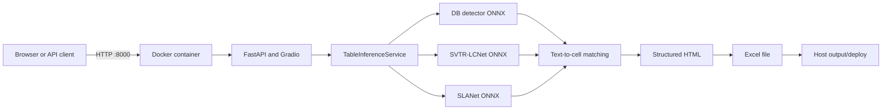

# Docker trong AutoOCR Table-to-Excel

Tài liệu này giải thích cách Docker được áp dụng trong project AutoOCR
Table-to-Excel, từ cách đóng gói ứng dụng, gắn model ONNX, cấp quyền truy cập
GPU, khởi động FastAPI/Gradio cho đến cách kiểm tra và xử lý lỗi. Nội dung bám
theo đúng các file [`Dockerfile`](Dockerfile), [`compose.yaml`](compose.yaml),
[`.dockerignore`](.dockerignore) và [`.env.example`](.env.example) của project.

> Docker trong repository này được dùng cho **deployment inference**, không dùng
> để train DB, SVTR-LCNet hoặc SLANet. Training vẫn chạy bằng PaddlePaddle trong
> môi trường `.venv` của project.

## 1. Docker giải quyết vấn đề gì?

Nếu chạy deployment trực tiếp trên máy, người dùng phải tự chuẩn bị đúng phiên
bản Python, ONNX Runtime, OpenCV, FastAPI, Gradio, thư viện hệ thống và CUDA.
Chỉ cần một phiên bản không tương thích là ứng dụng có thể chạy khác với máy đã
phát triển.

Docker đóng gói các thành phần đó thành một **image có thể tái tạo**. Từ image,
Docker tạo ra một **container** cô lập để chạy dịch vụ OCR.

Có thể hình dung:

```text
Source code + dependencies + runtime
                 |
                 | docker build
                 v
          Docker image bất biến
                 |
                 | docker run / compose up
                 v
        Container đang chạy dịch vụ
```

Trong project này, Docker mang lại các lợi ích chính:

- tái tạo cùng môi trường inference trên nhiều máy;
- tách dependencies deployment khỏi môi trường training;
- cung cấp image riêng cho CPU và GPU;
- cấu hình các model bằng biến môi trường thay vì sửa code;
- kiểm tra health, tự khởi động lại và quản lý log thống nhất;
- giới hạn vùng được ghi trong container;
- giúp chạy FastAPI và Gradio bằng một lệnh Compose.

## 2. Docker nằm ở đâu trong toàn bộ hệ thống?

Pipeline model đã được train và export sang ONNX trước khi Docker được sử dụng.
Docker chỉ đóng gói và phục vụ pipeline inference:



Hai phần quan trọng nằm ngoài image:

1. `models/` trên máy host được mount vào `/app/models` ở chế độ chỉ đọc;
2. `output/deploy/` được mount vào `/app/output/deploy` để file Excel tồn tại
   ngoài vòng đời container.

Thiết kế này giúp thay model mà không phải đóng gói lại image và tránh đưa các
checkpoint lớn vào Git hoặc Docker build context.

## 3. Các khái niệm Docker được áp dụng

### 3.1 Image và container

- **Image** là bản đóng gói bất biến chứa hệ điều hành nền, Python, thư viện và
  source code.
- **Container** là một instance đang chạy của image.

Project tạo hai image logic:

| Image | Base image | ONNX Runtime | Mục đích |
|---|---|---|---|
| `ocr-table-to-excel:cpu` | `python:3.12-slim-bookworm` | `onnxruntime` | Inference chỉ bằng CPU |
| `ocr-table-to-excel:gpu` | `nvidia/cuda:12.8.1-cudnn-runtime-ubuntu24.04` | `onnxruntime-gpu` | Inference CUDA hoặc hybrid |

Các profile `gpu`, `gpu-hybrid` và `gpu-mixed` dùng chung GPU image nhưng truyền
cấu hình runtime khác nhau.

### 3.2 Build context

Trong Compose, `build.context: .` đặt thư mục project làm **build context**.
Docker chỉ có thể `COPY` các file nằm trong context và không bị `.dockerignore`
loại bỏ.

```yaml
build:
  context: .
  target: gpu
```

Build context càng nhỏ thì quá trình gửi dữ liệu vào Docker daemon và build
image càng nhanh.

### 3.3 Dockerfile stages và build target

`Dockerfile` định nghĩa hai stage độc lập có tên `cpu` và `gpu`:

```dockerfile
FROM python:3.12-slim-bookworm AS cpu
...
FROM nvidia/cuda:12.8.1-cudnn-runtime-ubuntu24.04 AS gpu
```

Compose chọn stage bằng `target`:

```yaml
target: cpu
```

hoặc:

```yaml
target: gpu
```

Nhờ đó project dùng chung một Dockerfile nhưng vẫn tạo đúng môi trường cho từng
loại phần cứng.

### 3.4 Layer và build cache

Mỗi lệnh `FROM`, `RUN`, `COPY` tạo ra một layer. Dockerfile copy requirements và
cài dependency trước khi copy toàn bộ source code:

```dockerfile
COPY requirements-deploy-common.txt requirements-deploy-cpu.txt ./
RUN python -m pip install --no-cache-dir \
    -r requirements-deploy-common.txt -r requirements-deploy-cpu.txt
COPY . .
```

Nếu chỉ sửa code mà không sửa requirements, Docker có thể tái sử dụng layer cài
package. Đây là lý do thứ tự các lệnh trong Dockerfile ảnh hưởng trực tiếp đến
tốc độ rebuild.

### 3.5 Port mapping

Uvicorn lắng nghe cổng `8000` bên trong container. Compose ánh xạ cổng host sang
cổng container:

```yaml
ports:
  - "8000:8000"
```

Cú pháp là:

```text
HOST_PORT:CONTAINER_PORT
```

Vì vậy trình duyệt trên Windows truy cập `http://localhost:8000`, còn request
được chuyển vào cổng `8000` của container.

`EXPOSE 8000` trong Dockerfile chỉ mô tả cổng ứng dụng dự kiến sử dụng; chính
`ports` trong Compose mới publish cổng ra máy host.

### 3.6 Bind mount và dữ liệu bền vững

Compose sử dụng hai bind mount:

```yaml
volumes:
  - ./models:/app/models:ro
  - ./output/deploy:/app/output/deploy
```

Ý nghĩa:

| Đường dẫn host | Đường dẫn container | Quyền | Vai trò |
|---|---|---|---|
| `./models` | `/app/models` | read-only | Model ONNX và dictionary |
| `./output/deploy` | `/app/output/deploy` | read-write | File Excel tạm/thành phẩm |

Hậu tố `:ro` bảo vệ model khỏi bị sửa hoặc xóa từ bên trong container. Output
được mount read-write vì dịch vụ cần tạo file `.xlsx`.

Nếu container bị xóa, dữ liệu trong hai thư mục host vẫn còn.

### 3.7 Environment variables và `.env`

Ứng dụng không hard-code model path hoặc provider. Compose đọc `.env`:

```yaml
env_file:
  - .env
```

Ví dụ:

```dotenv
OCR_DET_MODEL=./models/det/model_fp32.onnx
OCR_REC_MODEL=./models/rec/model_fp32.onnx
OCR_TABLE_MODEL=./models/table/model_fp32.onnx
OCR_MAX_CONCURRENCY=1
OCR_WARMUP_RUNS=1
```

Do `WORKDIR` là `/app`, đường dẫn `./models/...` bên trong container được hiểu là
`/app/models/...`, đúng với mount của Compose.

`.env.example` là cấu hình mẫu được commit lên Git. `.env` là cấu hình thực tế
và bị loại khỏi Git/Docker build context để tránh vô tình công khai cấu hình
riêng hoặc secret.

### 3.8 Compose profiles

Profiles cho phép giữ nhiều phương án deployment trong cùng một file nhưng chỉ
khởi động profile được yêu cầu.

| Profile | Detector | Recognizer | SLANet | Model precision | Trường hợp dùng |
|---|---|---|---|---|---|
| `cpu` | CPU | CPU | CPU | FP32 | Máy không có NVIDIA GPU |
| `gpu` | CUDA | CUDA | CUDA | FP32 | Kiểm thử toàn bộ pipeline trên GPU |
| `gpu-hybrid` | CUDA | CUDA | CPU | FP32 | Profile production được khuyến nghị trên máy đã benchmark |
| `gpu-mixed` | CUDA | CUDA | CUDA | DB FP32, REC/SLA FP16 | Thử nghiệm mixed precision |

`gpu-hybrid` giữ DB và SVTR-LCNet trên CUDA nhưng chạy SLANet trên CPU. SLANet
decode autoregressive từng bước; trên phần cứng thử nghiệm, chi phí launch nhiều
GPU kernel nhỏ lớn hơn lợi ích tính toán song song. Vì vậy “tất cả trên GPU”
không mặc định là nhanh nhất.

Chỉ chạy một profile tại một thời điểm vì tất cả service đều bind cổng host
`8000`.

### 3.9 GPU passthrough

Các GPU service khai báo:

```yaml
gpus: all
```

Docker không mang theo NVIDIA driver kernel trong image. Driver nằm trên máy
host; Docker Desktop/NVIDIA Container Toolkit cấp GPU vào container. Image GPU
chỉ chứa CUDA/cuDNN runtime và `onnxruntime-gpu` tương thích.

CUDA 11.8 dùng để train bằng PaddlePaddle trên Windows không bắt buộc phải giống
CUDA runtime 12.8 trong container inference. Đây là hai môi trường độc lập:

```text
Host .venv training: PaddlePaddle GPU + CUDA 11.8
Docker inference:    ONNX Runtime GPU + CUDA 12.8/cuDNN runtime
```

Điều quan trọng là NVIDIA driver host đủ mới để chạy CUDA runtime của container.

### 3.10 Healthcheck, liveness và readiness

Dockerfile có healthcheck gọi `/ready` định kỳ:

```dockerfile
HEALTHCHECK --interval=30s --timeout=10s --start-period=180s --retries=3 \
  CMD ["python", "-c", "import urllib.request; urllib.request.urlopen('http://127.0.0.1:8000/ready', timeout=5)"]
```

Project phân biệt:

- `/live`: process web còn hoạt động;
- `/ready`: ba model đã load, kiểm tra tensor contract, warm-up xong và sẵn sàng
  nhận request;
- `/health`: trả thông tin provider, uptime và concurrency.

GPU có `start-period` dài hơn CPU vì lần đầu khởi tạo CUDA và warm-up có thể lâu
hơn. Container chỉ được xem là healthy khi readiness thành công.

### 3.11 CMD và tiến trình chính

Container khởi động Uvicorn bằng:

```dockerfile
CMD ["python", "-m", "uvicorn", "deploy.app:app",
     "--host", "0.0.0.0", "--port", "8000",
     "--workers", "1", "--no-access-log"]
```

`0.0.0.0` là bắt buộc trong container; nếu bind `127.0.0.1`, port mapping từ
host không thể truy cập ứng dụng.

Project dùng một worker vì mỗi worker sẽ tạo một bản sao của cả ba ONNX session,
làm tăng RAM/VRAM. Khả năng xử lý đồng thời được kiểm soát bằng
`OCR_MAX_CONCURRENCY` và semaphore trong `TableInferenceService`.

### 3.12 Restart policy và init process

```yaml
restart: unless-stopped
init: true
```

- `restart: unless-stopped` tự chạy lại container sau crash hoặc sau khi Docker
  daemon khởi động lại, trừ khi người dùng chủ động stop;
- `init: true` thêm init process nhỏ để chuyển signal và thu dọn zombie process
  đúng cách.

### 3.13 Read-only filesystem và tmpfs

```yaml
read_only: true
tmpfs:
  - /tmp:size=1g
```

Filesystem gốc của container được đặt read-only. Chỉ output bind mount và `/tmp`
được ghi. `/tmp` là tmpfs nằm trong bộ nhớ, có giới hạn 1 GB và biến mất khi
container dừng.

Đây là hardening quan trọng: nếu ứng dụng gặp lỗi hoặc bị khai thác, phạm vi ghi
file bị thu hẹp đáng kể.

### 3.14 Non-root user

Dockerfile tạo user hệ thống `app` rồi chuyển sang user này:

```dockerfile
USER app
```

Web service không chạy bằng `root`, giảm hậu quả nếu có lỗ hổng trong API hoặc
dependency.

### 3.15 `.dockerignore`

`.dockerignore` loại các dữ liệu không cần thiết khỏi build context, gồm:

- `.git`, IDE settings và cache Python;
- `.venv`, Python local và thư viện CUDA local;
- dataset, training output và PaddleOCR training source;
- test, log và output cũ;
- `.env`;
- các file ONNX/Paddle model lớn.

Model bị ignore có chủ đích vì được cung cấp qua bind mount. Điều này làm image
nhẹ hơn, tránh rò rỉ checkpoint và cho phép cập nhật model độc lập với image.

## 4. Dockerfile được thực thi như thế nào?

### 4.1 CPU target

Quá trình build CPU gồm:

1. dùng Python 3.12 slim làm base image;
2. cài `libglib2.0-0` cho OpenCV và `libgomp1` cho OpenMP;
3. tạo user không có quyền root;
4. cài dependency chung và `onnxruntime` CPU;
5. copy source code;
6. tạo thư mục output;
7. khai báo healthcheck;
8. chạy Uvicorn bằng user `app`.

### 4.2 GPU target

Quá trình build GPU gồm:

1. dùng NVIDIA CUDA 12.8.1 + cuDNN runtime trên Ubuntu 24.04;
2. cài Python 3.12 và tạo venv nội bộ tại `/opt/venv`;
3. đưa `/opt/venv/bin` lên đầu `PATH`;
4. cài dependency chung và `onnxruntime-gpu`;
5. copy source code, tạo output và chuyển sang user `app`;
6. khai báo healthcheck có thời gian chờ khởi động dài hơn;
7. chạy Uvicorn.

Venv `/opt/venv` nằm **bên trong image GPU**, hoàn toàn khác `.venv` trên máy
Windows. Docker không sử dụng `.venv` của host.

## 5. Luồng khởi động container

Khi chạy `docker compose up`, hệ thống thực hiện tuần tự:

```text
1. Compose chọn profile và build target
2. Docker tạo container từ image
3. Compose nạp biến trong .env
4. Compose mount models và output
5. Compose cấp GPU nếu profile yêu cầu
6. Uvicorn khởi động FastAPI
7. Lifespan tạo TableInferenceService đúng một lần
8. ONNX Runtime load DB, SVTR-LCNet và SLANet
9. Service kiểm tra input/output tensor của ba model
10. Service xác nhận CUDA provider không fallback ngoài ý muốn
11. Warm-up chạy inference giả
12. /ready trả status=ready
13. Docker đánh dấu container healthy
```

Khi có request ảnh:

```text
Upload image
  -> kiểm tra content type và dung lượng
  -> OpenCV decode
  -> chờ inference semaphore
  -> DB detect text boxes
  -> SVTR-LCNet recognize cell text
  -> SLANet predict HTML structure and cell boxes
  -> match text to cells
  -> build HTML
  -> convert HTML to XLSX
  -> trả JSON/HTML hoặc Excel
```

## 6. Chuẩn bị trước khi chạy

### 6.1 Yêu cầu chung

- Docker Desktop đang chạy với Linux containers;
- WSL2 backend được bật trên Windows;
- cổng `8000` chưa bị ứng dụng khác sử dụng;
- model ONNX và dictionary đã tồn tại đúng vị trí;
- có file `.env` ở repository root.

GPU profile cần thêm:

- NVIDIA GPU;
- NVIDIA driver tương thích;
- Docker Desktop có quyền truy cập GPU.

### 6.2 Chuẩn bị model

Tải model từ:

[Google Drive - pretrained models and checkpoints](https://drive.google.com/drive/folders/1JH42pMtsKQ1tRaoEezmb3kAaKzxIAAwf?usp=drive_link)

Cấu trúc tối thiểu cho FP32:

```text
models/
|-- det/
|   `-- model_fp32.onnx
|-- rec/
|   `-- model_fp32.onnx
|-- table/
|   `-- model_fp32.onnx
`-- dictionaries/
    |-- table_dict.txt
    `-- table_structure_dict.txt
```

Kiểm tra trong PowerShell:

```powershell
Test-Path models\det\model_fp32.onnx
Test-Path models\rec\model_fp32.onnx
Test-Path models\table\model_fp32.onnx
Test-Path models\dictionaries\table_dict.txt
Test-Path models\dictionaries\table_structure_dict.txt
```

Năm kết quả phải là `True`.

### 6.3 Tạo `.env`

```powershell
if (-not (Test-Path .env)) {
  Copy-Item .env.example .env
}
```

Không cần activate `.venv` để dùng Docker. `.venv` chỉ cần cho các lệnh Python
chạy trực tiếp trên host.

## 7. Kiểm tra Docker và GPU

Kiểm tra Docker daemon:

```powershell
docker version
docker info
docker context show
```

`docker version` phải có cả `Client` và `Server`.

Kiểm tra GPU bên trong container:

```powershell
docker run --rm --gpus all `
  nvidia/cuda:12.8.1-base-ubuntu24.04 `
  nvidia-smi
```

Nếu bảng `nvidia-smi` hiển thị GPU thì GPU passthrough đã hoạt động.

## 8. Build và chạy các profile

### 8.1 CPU

```powershell
docker compose --profile cpu up -d --build
```

### 8.2 GPU FP32

```powershell
docker compose --profile gpu up -d --build
```

### 8.3 GPU hybrid FP32 - khuyến nghị

```powershell
docker compose --profile gpu-hybrid up -d --build
```

### 8.4 GPU mixed FP16 - thử nghiệm

Profile này cần thêm:

```text
models/rec/model_fp16.onnx
models/table/model_fp16.onnx
```

Sau đó chạy:

```powershell
docker compose --profile gpu-mixed up -d --build
```

Không nên chọn FP16 chỉ vì file nhỏ hơn. Project giữ DB ở FP32 vì detector FP16
không đạt ngưỡng parity đã đặt khi so với FP32.

## 9. Kiểm tra service sau khi khởi động

Xem trạng thái container:

```powershell
docker compose ps
```

Theo dõi log:

```powershell
docker compose logs -f --tail 100
```

Kiểm tra liveness:

```powershell
Invoke-RestMethod http://localhost:8000/live
```

Kiểm tra readiness và provider thực tế:

```powershell
Invoke-RestMethod http://localhost:8000/ready |
  ConvertTo-Json -Depth 8
```

Với `gpu-hybrid`, kết quả mong đợi:

```text
detector   -> CUDAExecutionProvider, CPUExecutionProvider
recognizer -> CUDAExecutionProvider, CPUExecutionProvider
SLANet     -> CPUExecutionProvider
```

Nếu detector hoặc recognizer chỉ có `CPUExecutionProvider`, cấu hình CUDA chưa
hoạt động đúng. Service được thiết kế để báo lỗi thay vì âm thầm chạy CPU khi
profile bắt buộc CUDA.

## 10. Sử dụng API và giao diện

| Chức năng | Địa chỉ |
|---|---|
| Gradio UI | `http://localhost:8000/ui` |
| Swagger UI | `http://localhost:8000/docs` |
| Liveness | `http://localhost:8000/live` |
| Readiness | `http://localhost:8000/ready` |
| Nhận JSON/HTML | `POST /v1/table/recognize` |
| Tải Excel | `POST /v1/table/excel` |

Xuất ảnh bảng thành Excel:

```powershell
curl.exe --fail `
  -F "file=@path\to\table.png;type=image/png" `
  http://localhost:8000/v1/table/excel `
  --output table_result.xlsx
```

Nhận kết quả JSON và HTML:

```powershell
curl.exe --fail `
  -F "file=@path\to\table.png;type=image/png" `
  http://localhost:8000/v1/table/recognize
```

## 11. Các lệnh vận hành thường dùng

### Xem image

```powershell
docker image ls "ocr-table-to-excel*"
```

### Xem container và health

```powershell
docker compose ps
docker inspect --format='{{json .State.Health}}' `
  $(docker compose ps -q)
```

### Xem mức sử dụng CPU, RAM và GPU container

```powershell
docker stats
```

Để xem GPU trực tiếp trên host:

```powershell
nvidia-smi
```

### Restart service

```powershell
docker compose restart
```

### Dừng và xóa container/network của Compose

```powershell
docker compose --profile gpu-hybrid down
```

Lệnh `down` không xóa model hoặc output vì chúng nằm trong thư mục host.

### Rebuild sau khi sửa code

```powershell
docker compose --profile gpu-hybrid up -d --build
```

### Rebuild sạch cache khi nghi ngờ layer cũ

```powershell
docker compose --profile gpu-hybrid build --no-cache
docker compose --profile gpu-hybrid up -d
```

Chỉ dùng `--no-cache` khi cần; build bình thường nhanh hơn nhờ layer cache.

## 12. Khi nào cần rebuild hoặc restart?

| Thay đổi | Cần làm gì? | Lý do |
|---|---|---|
| Sửa Python source | Rebuild image | Source đã được `COPY` vào image |
| Sửa requirements | Rebuild image | Dependency nằm trong image |
| Sửa Dockerfile | Rebuild image | Cấu trúc image thay đổi |
| Sửa `.env` | Recreate container | Environment được nạp lúc container được tạo |
| Thay file ONNX/dictionary | Restart container | File được mount, nhưng ONNX session chỉ load lúc startup |
| Xóa/tạo file trong output | Không cần rebuild | Output là bind mount runtime |

Recreate sau khi sửa `.env`:

```powershell
docker compose --profile gpu-hybrid up -d --force-recreate
```

Restart sau khi thay model:

```powershell
docker compose restart
```

## 13. Tối ưu hiệu năng trong Docker

### 13.1 Chọn đúng execution provider

ONNX Runtime provider quyết định model chạy ở đâu. Project cho phép cấu hình
provider riêng cho từng stage:

```dotenv
OCR_DET_ONNX_PROVIDERS=CUDAExecutionProvider,CPUExecutionProvider
OCR_REC_ONNX_PROVIDERS=CUDAExecutionProvider,CPUExecutionProvider
OCR_TABLE_ONNX_PROVIDERS=CPUExecutionProvider
```

Thứ tự có ý nghĩa: ONNX Runtime ưu tiên provider đứng trước và dùng provider
sau làm fallback cho operator không được provider trước hỗ trợ.

### 13.2 Warm-up

```dotenv
OCR_WARMUP_RUNS=1
```

Warm-up tạo session, chọn CUDA kernel, cấp phát memory arena và chạy inference
giả trước khi service nhận traffic. Vì vậy request đầu tiên không phải trả toàn
bộ chi phí khởi tạo.

### 13.3 Bounded concurrency

```dotenv
OCR_MAX_CONCURRENCY=1
OCR_ACQUIRE_TIMEOUT_SECONDS=30
```

Inference đồng thời quá cao có thể làm đầy VRAM, tăng P95 hoặc khiến process bị
OOM. Semaphore giới hạn số request đi vào pipeline. Khi hết capacity quá thời
gian cho phép, API trả `429` thay vì làm server mất ổn định.

Chỉ tăng concurrency sau khi đo peak RAM/VRAM, throughput và P95 trên đúng phần
cứng deployment.

### 13.4 ONNX Runtime memory và thread settings

Các biến sau điều khiển graph optimization, CPU threads và memory arena:

```dotenv
OCR_ONNX_THREADS=0
OCR_ONNX_INTER_OP_THREADS=0
OCR_ONNX_GRAPH_OPTIMIZATION=all
OCR_ONNX_EXECUTION_MODE=sequential
OCR_ONNX_ENABLE_MEM_PATTERN=true
OCR_ONNX_ENABLE_CPU_MEM_ARENA=true
```

Giá trị thread `0` để ONNX Runtime chọn mặc định. `sequential` phù hợp với graph
nhỏ và tránh overhead scheduling không cần thiết. Không nên thay hàng loạt các
giá trị này nếu chưa benchmark.

### 13.5 Kết quả benchmark hiện tại

Trên RTX 4060 8 GB, 10 request lặp lại trên một ảnh validation cho kết quả:

| Profile | Mean | Median | P95 |
|---|---:|---:|---:|
| CPU FP32 | 1.724 s | - | 1.917 s |
| All-CUDA FP32 | 1.537 s | 1.482 s | 1.843 s |
| GPU hybrid FP32 | **0.610 s** | **0.586 s** | **0.648 s** |

Hybrid nhanh khoảng `1.724 / 0.610 = 2.83x` so với CPU trong smoke benchmark
này. Đây không phải benchmark chất lượng trên toàn dataset; cần chạy lại script
benchmark trên phần cứng và dữ liệu production.

## 14. Bảo mật và độ ổn định

Project áp dụng nhiều lớp bảo vệ:

- chạy bằng non-root user;
- root filesystem read-only;
- model mount read-only;
- `/tmp` có giới hạn 1 GB;
- `.env` không được copy vào image;
- giới hạn loại file và kích thước upload;
- tên file output được sinh bằng UUID;
- file Excel trả về được xóa bằng background task;
- output cũ được dọn theo TTL;
- concurrency có giới hạn và timeout;
- model tensor contract được kiểm tra trước readiness;
- provider CUDA được xác nhận, tránh fallback im lặng;
- healthcheck và restart policy giúp service tự phục hồi.

Các biện pháp nên bổ sung khi public service ra Internet:

- reverse proxy như Nginx/Traefik;
- HTTPS/TLS;
- authentication/API key;
- rate limiting theo IP hoặc user;
- log aggregation và metrics;
- network/firewall rule chỉ mở cổng cần thiết;
- image vulnerability scanning và dependency update định kỳ.

## 15. Xử lý lỗi thường gặp

### 15.1 Không kết nối được Docker API

Thông báo thường gặp:

```text
failed to connect to the docker API at
npipe:////./pipe/dockerDesktopLinuxEngine
```

Nguyên nhân: Docker Desktop Linux Engine chưa chạy hoặc context sai.

```powershell
docker context ls
docker context use desktop-linux
docker version
docker info
```

Nếu vẫn lỗi:

```powershell
wsl --shutdown
```

Sau đó mở lại Docker Desktop, chờ `Engine running` rồi thử lại.

### 15.2 Container báo thiếu model

Kiểm tra file trên host:

```powershell
Test-Path models\det\model_fp32.onnx
Test-Path models\rec\model_fp32.onnx
Test-Path models\table\model_fp32.onnx
```

Kiểm tra mount trong container đang chạy:

```powershell
docker compose exec ocr-gpu-hybrid ls -la /app/models/det
```

Nếu chạy profile khác, thay service name tương ứng: `ocr-cpu`, `ocr-gpu` hoặc
`ocr-gpu-mixed`.

### 15.3 Container không dùng GPU

Kiểm tra ba tầng:

```powershell
nvidia-smi
docker run --rm --gpus all `
  nvidia/cuda:12.8.1-base-ubuntu24.04 nvidia-smi
Invoke-RestMethod http://localhost:8000/ready |
  ConvertTo-Json -Depth 8
```

- lệnh thứ nhất kiểm tra driver host;
- lệnh thứ hai kiểm tra GPU passthrough;
- lệnh thứ ba kiểm tra ONNX Runtime provider của từng model.

### 15.4 Cổng 8000 đã được sử dụng

```powershell
Get-NetTCPConnection -LocalPort 8000 -ErrorAction SilentlyContinue
docker compose ps
```

Dừng profile cũ trước khi chạy profile mới:

```powershell
docker compose down
```

Hoặc đổi host port trong `compose.yaml`, ví dụ `8001:8000`, rồi truy cập
`http://localhost:8001`.

### 15.5 Container `unhealthy`

```powershell
docker compose ps
docker compose logs --tail 200
docker inspect --format='{{json .State.Health}}' `
  $(docker compose ps -q)
```

Các nguyên nhân thường gặp:

- model path trong `.env` sai;
- thiếu dictionary;
- ONNX model không đúng input/output contract;
- CUDA provider không load được;
- warm-up lỗi;
- host hết RAM/VRAM.

### 15.6 Sửa `.env` nhưng cấu hình không đổi

`restart` không tạo lại container và có thể giữ environment cũ. Dùng:

```powershell
docker compose --profile gpu-hybrid up -d --force-recreate
```

### 15.7 Sửa code nhưng container vẫn chạy code cũ

Source code được copy vào image, không bind mount. Cần rebuild:

```powershell
docker compose --profile gpu-hybrid up -d --build
```

## 16. Triển khai trên máy khác

Quy trình tối thiểu:

```text
1. Cài Git và Docker
2. Clone repository
3. Tải model ONNX và dictionary vào models/
4. Copy .env.example thành .env
5. Kiểm tra Docker/GPU
6. Chạy profile phù hợp
7. Kiểm tra /ready
8. Gửi một request smoke test
```

Các lệnh chính:

```powershell
git clone https://github.com/trungphan27/AutoOCR_table_to_excel.git
Set-Location AutoOCR_table_to_excel
Copy-Item .env.example .env
docker compose --profile gpu-hybrid up -d --build
Invoke-RestMethod http://localhost:8000/ready |
  ConvertTo-Json -Depth 8
```

Nếu máy không có NVIDIA GPU, thay profile bằng `cpu`.

## 17. Tóm tắt kiến thức Docker qua project

| Khái niệm | Cách project áp dụng |
|---|---|
| Image | Đóng gói Python, dependencies, source và runtime |
| Container | Chạy FastAPI/Gradio và ba ONNX sessions |
| Dockerfile | Mô tả cách build CPU/GPU image |
| Stage/target | Chọn môi trường `cpu` hoặc `gpu` từ một Dockerfile |
| Layer/cache | Cache dependency để rebuild code nhanh hơn |
| Build context | Repository root, được lọc bằng `.dockerignore` |
| Port mapping | Host `8000` chuyển tới container `8000` |
| Bind mount | Gắn model read-only và output read-write |
| Environment | Cấu hình model/provider qua `.env` |
| Compose profile | Chọn CPU, GPU, hybrid hoặc mixed precision |
| GPU passthrough | Cấp NVIDIA GPU host cho ONNX Runtime container |
| Healthcheck | Chỉ báo healthy sau load, validation và warm-up |
| Non-root user | Hạn chế quyền của web service |
| Read-only root FS | Giảm vùng container có thể ghi |
| tmpfs | Cung cấp vùng tạm trong RAM có giới hạn |
| Restart policy | Tự phục hồi sau crash/daemon restart |
| Persistent data | Model và Excel tồn tại ngoài container |

## 18. Checklist production

- [ ] Docker daemon đang chạy.
- [ ] Linux containers/WSL2 hoạt động.
- [ ] `docker version` có Client và Server.
- [ ] GPU passthrough thành công nếu dùng GPU.
- [ ] Ba model và hai dictionary tồn tại.
- [ ] `.env` đúng model path và provider.
- [ ] Chỉ một Compose profile bind cổng 8000.
- [ ] `docker compose ps` báo healthy.
- [ ] `/ready` hiển thị đúng provider của từng model.
- [ ] API JSON và Excel smoke test thành công.
- [ ] Đã benchmark latency, P95, RAM và VRAM trên máy đích.
- [ ] Có HTTPS, authentication và rate limit nếu public Internet.
- [ ] Không commit `.env`, model, output hoặc dữ liệu nhạy cảm.

## 19. Lệnh nhanh

```powershell
# Chuẩn bị cấu hình
Copy-Item .env.example .env

# Kiểm tra GPU Docker
docker run --rm --gpus all `
  nvidia/cuda:12.8.1-base-ubuntu24.04 nvidia-smi

# Build và chạy profile được khuyến nghị
docker compose --profile gpu-hybrid up -d --build

# Theo dõi trạng thái
docker compose ps
docker compose logs -f --tail 100

# Kiểm tra readiness
Invoke-RestMethod http://localhost:8000/ready |
  ConvertTo-Json -Depth 8

# Mở Gradio
Start-Process http://localhost:8000/ui

# Dừng deployment
docker compose --profile gpu-hybrid down
```

Tài liệu cài đặt, training, export và deployment đầy đủ nằm tại
[`README_END_TO_END.md`](README_END_TO_END.md).
